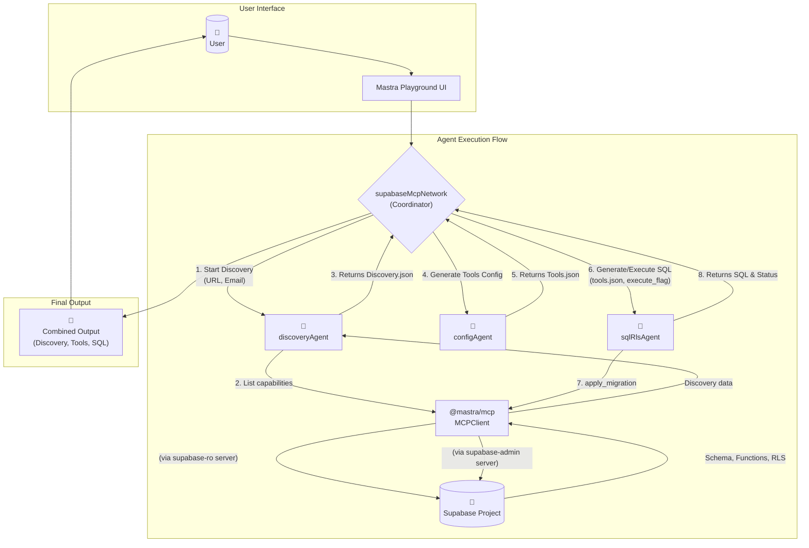

# Mastra Supabase MCP Configurator

A production-grade Mastra Agent Network that discovers existing Supabase capabilities and generates safe tooling configurations using the Model Context Protocol (MCP). This project creates discovery-only agents that enumerate what exists without creation or suggestions, following strict exposure rules.

## Features

- **Discovery Agent**: Read-only enumeration of Supabase capabilities via MCP
- **Config Generator Agent**: Converts discovery data into safe tools array JSON  
- **SQL/RLS Agent**: Creates and manages tool_configurations table with Row Level Security
- **Agent Network**: Orchestrates the workflow with intelligent routing
- **MCP Integration**: Uses official Supabase MCP server for secure access

## Architecture

The system consists of three specialized agents coordinated by an Agent Network:

1. **supabase-discovery** - Enumerates existing Supabase capabilities (Edge Functions, DB Functions, Tables, RLS policies, Extensions)
2. **tools-config-generator** - Converts discovery data into tools following strict exposure rules
3. **sql-rls-setup** - Creates tool_configurations table with RLS policies and optional execution

   


## Prerequisites

- Node.js v20.0 or higher
- OpenAI API key
- Supabase Access Token (PAT with admin scope)
- Optional: Supabase Project Reference for scoped discovery

## Installation

1. **Clone and setup the project:**
   ```powershell
   git clone <repository-url>
   cd mastraMCPBuilder
   ```

2. **Install dependencies:**
   ```powershell
   pnpm install
   ```

3. **Configure environment variables:**
   ```powershell
   Copy-Item env.template .env.local
   ```
   
   Edit `.env.local` with your credentials:
   ```bash
   OPENAI_API_KEY=your_openai_api_key_here
   SUPABASE_ACCESS_TOKEN=your_supabase_access_token_here
   # Optional: Scope discovery to specific project
   SUPABASE_PROJECT_REF=your_project_ref_here
   ```

   **Note:** All agents use the `gpt-4o-mini` model for cost-effective operation.

## Usage

### Start the Development Server

```powershell
pnpm run dev
```

### Using the Mastra Playground

1. Open the Playground UI
2. Choose "supabase-mcp-configurator" network
3. Provide required information:
   - Supabase project name (optional, human-readable label)
   - Supabase project URL (https://yourproject.supabase.co)
   - Supabase anon key (optional, for client examples)
   - CONFIG_EMAIL (email for RLS policies ownership)

### Sample Workflow

1. **Discovery Phase:**
   ```
   "Discover my project: URL=https://xyz.supabase.co, email=user@example.com"
   ```

2. **Generate Tools Configuration:**
   ```
   "Generate the tools JSON from the discovery"
   ```

3. **Create Infrastructure:**
   ```
   "Create the tool_configurations table and RLS; do not execute yet"
   ```

4. **Execute SQL:**
   ```
   "Now execute the SQL"
   ```

5. **Insert Configuration:**
   ```
   "Insert this tools JSON as my next active configuration"
   ```

## Project Structure

```
mastraMCPBuilder/
├── src/
│   ├── agents/
│   │   ├── discoveryAgent.ts      # Read-only Supabase discovery
│   │   ├── configAgent.ts         # Tools JSON generator
│   │   ├── sqlRlsAgent.ts         # SQL/RLS management
│   │   └── routerHints.ts         # User input schema hints
│   ├── mcp/
│   │   └── supabaseMcp.ts         # MCP client configuration
│   ├── network/
│   │   └── supabaseMcpNetwork.ts  # Agent orchestration
│   └── index.ts                   # Main Mastra entry point
├── package.json
├── tsconfig.json
├── env.template                   # Environment variables template
├── implementationPlan.md          # Detailed implementation guide
└── README.md
```

## MCP Configuration

The system uses two MCP server configurations:

- **supabase-ro**: Read-only discovery with optional project scoping
- **supabase-admin**: Full admin access for SQL execution

Both connect to the official Supabase MCP server via stdio transport.

## Discovery Output Schema

The discovery agent returns a strict JSON structure:

```json
{
  "edge_functions": [{"name": "string", "status": "deployed|unknown"}],
  "db_functions": [{"schema": "string", "name": "string", "args": [...], "returns": "string", "volatility": "string|null"}],
  "tables": [{
    "schema": "string",
    "name": "string", 
    "columns": [...],
    "primary_key": [...],
    "foreign_keys": [...],
    "unique_indexes": [...],
    "rls_enabled": "boolean",
    "policies": [...],
    "sensitive_columns": [...]
  }],
  "extensions": [...],
  "limitations": [...]
}
```

## Tools Configuration Schema

The config generator produces tools following these rules:

- **Read operations**: Prioritized for all tables with explicit column selection
- **Write operations**: Only when tables have clear primary keys and safe RLS policies
- **Relationships**: Only through explicit foreign keys from discovery
- **Filters**: Support standard comparison operators for discovered columns
- **Security**: Respects RLS settings and marks service role requirements
- **Sensitive data**: Excludes from default selects, restricts write access

## SQL/RLS Schema

Creates a `tool_configurations` table with:

```sql
CREATE TABLE tool_configurations (
  id bigint GENERATED ALWAYS AS IDENTITY PRIMARY KEY,
  email text NOT NULL,
  project_name text,
  version int NOT NULL DEFAULT 1,
  tools jsonb NOT NULL,
  is_active boolean NOT NULL DEFAULT true,
  created_at timestamptz NOT NULL DEFAULT now(),
  updated_at timestamptz NOT NULL DEFAULT now()
);
```

With RLS policies for:
- `select_own_active`: Users can only see their own active configurations
- `insert_own`: Users can only insert with their own email
- `update_own`: Users can only update their own configurations  
- `deactivate_own`: Users can deactivate their own configurations

## Security Guardrails

- **Discovery-only**: Agents refuse to create or infer beyond discovered artifacts
- **Safe exposure**: Config generator enforces update-splitting, safe filters, FK-only relationships
- **Isolation**: SQL agent only touches tool_configurations table and related RLS policies
- **Validation**: All operations include strict input validation and error handling

## Development Scripts

```powershell
# Development with hot reload
pnpm run dev

# Build TypeScript
pnpm run build

# Run production build  
pnpm run start
```

## Troubleshooting

### Common Issues

1. **TypeScript Compilation Errors**
   - Ensure you're using compatible versions: `@ai-sdk/openai@^1.0.0`, `@mastra/core@^0.13.0`, `@mastra/mcp@^0.10.0`
   - Run `pnpm install` to update dependencies
   - If you see `defaultObjectGenerationMode` errors, downgrade AI SDK to v1.x

2. **MCP Connection Errors**
   - Verify SUPABASE_ACCESS_TOKEN has admin scope
   - Check network connectivity
   - Ensure Supabase MCP server is accessible

3. **Discovery Limitations**
   - Some tools may error due to permissions
   - Check "limitations" field in discovery output
   - Verify project access with provided PAT

4. **Tool Generation Issues**
   - Review discovery data for completeness
   - Check RLS policy configurations
   - Verify table relationships are explicit

## Contributing

1. Follow existing code patterns and agent instruction formats
2. Maintain discovery-only principles in discovery agent
3. Ensure config generator follows strict exposure rules
4. Test SQL operations against tool_configurations table only
5. Update documentation for any new features or changes

## License

[Add your license information here]
