# Mastra Supabase MCP Builder

A production-grade Mastra Agent Network that converts an existing Supabase project into a shareable MCP configuration for a custom MCP server “supamcpbuilder,” and generates a safe, minimal tools configuration based on user-selected categories.

Unlike generic Supabase MCP setups, this project explicitly targets your custom MCP server that fetches tools at runtime and is meant to be shared with end users.

## What this does

- Discovers existing Supabase capabilities in a read-only posture.
- Asks which tool categories to expose (e.g., table reads, updates-by-PK, RPCs).
- Generates a tools JSON that reflects only discovered schema and user-selected categories.
- Optionally creates tool_configurations with RLS to store/version the tools config.
- Produces a ready-to-paste MCP config for “supamcpbuilder” that your users can use to connect to the Supabase project via MCP.

## Why “supamcpbuilder”

- “supamcpbuilder” is your custom MCP server that fetches tools at runtime.
- The network’s final output includes a drop-in MCP config pointing to supamcpbuilder, with placeholders for end-user credentials.
- Owners keep project URL/anon key; end users supply their own email/password when they run the MCP client.

## Features

- Discovery Agent: Read-only enumeration of Supabase capabilities.
- Config Generator Agent: Builds a tools array JSON from discovery, filtered by requested categories and strict safety rules.
- SQL/RLS Agent: Creates a tool_configurations table with RLS and optional insert/versioning.
- Agent Network: Orchestrates the flow to produce DISCOVERY → TOOLS → MCP_CONFIG (+ optional SQL_JSON).
- MCP Integration: Uses Supabase MCP for discovery/admin, but the final shareable config is for your custom “supamcpbuilder.”

## Architecture

Three specialized agents coordinated by one network:

1) supabase-discovery
- Lists Edge Functions, DB Functions (RPC), Tables/Columns/PK/FK, RLS policies, enabled extensions, and sensitive columns using read-only tools.

2) tools-config-generator
- Converts discovery data into a safe tools array JSON aligned to your constraints:
  - FK-only relationships, no guesses.
  - Sensitive columns excluded by default from selects.
  - Updates split per-column and require PK; no mass updates.
  - Inserts minimal and safe; deletes only by PK if requested and clearly safe.
  - RPCs only if discovered and requested.

3) sql-rls-setup
- Creates tool_configurations and RLS policies, idempotent DDL, optional execution.
- Optional insert/versioning of the tools JSON owned by CONFIG_EMAIL.

The Agent Network coordinates inputs, runs discovery, generates tools, optionally applies SQL, and always emits the final MCP config for “supamcpbuilder.”

Mermaid overview

```mermaid
graph TD
  subgraph "Playground"
    User[("👤 User")] --> Network{"supabase-mcp-converter\n(Coordinator)"}
  end

  subgraph "Agents"
    Network -- "1) Discovery" --> D["🤖 discoveryAgent"]
    D --> MCP["@mastra/mcp\nMCPClient (read-only)"]
    MCP --> DB[("🐘 Supabase Project")]
    D -- "discovery.json" --> Network

    Network -- "2) Tools config" --> C["🤖 configAgent"]
    C -- "tools.json" --> Network

    Network -- "3) (Optional) SQL/RLS" --> S["🤖 sqlRlsAgent"]
    S --> MCPAdmin["@mastra/mcp\nMCPClient (admin)"]
    MCPAdmin --> DB
    S -- "sql_json" --> Network
  end

  Network -- "4) Final" --> Output["🧩 DISCOVERY + TOOLS + MCP_CONFIG (+ SQL_JSON)"]
  Output --> User
```



   


## Prerequisites

- Node.js v20+.
- OpenAI API key (model calls).
- Supabase Access Token (PAT with admin scope) for discovery/admin operations via Supabase MCP.
- Optional: Supabase Project Reference for scoped discovery.

## Installation

1) Clone and setup
- git clone 
- cd mastraMCPBuilder

2) Install dependencies
- pnpm install

3) Configure environment
- Copy env.template to .env.local, then set:
  - OPENAI_API_KEY=your_openai_api_key
  - SUPABASE_ACCESS_TOKEN=your_supabase_pat
  - SUPABASE_PROJECT_REF=your_project_ref (optional, for scoped discovery)

Note: Agents default to gpt-4o-mini/gpt-4o based on your project setup.

## Usage

Start the dev server
- pnpm run dev
- Open the Mastra Playground at http://localhost:4111
- Select the network “supabase-mcp-converter”

Provide required info when prompted
- project_name: Human-readable label (optional).
- project_url: https://your-project.supabase.co (used in final MCP config).
- config_email: Admin email owning the configuration (RLS ownership).
- tool_categories: Choose which tools to generate (tables_select, tables_insert, tables_update_by_pk, tables_delete_by_pk, rpc_functions, storage, auth, edge_functions).
- sql_setup: Whether to generate/execute tool_configurations DDL and policies; execute=true/false.

Sample prompts
- “Project URL=https://xyz.supabase.co, admin=user@example.com. Tool categories: tables_select, rpc_functions(list: count_orders). Don’t execute SQL yet.”
- “Generate the tools JSON from the discovery.”
- “Create the tool_configurations table and RLS; execute=false.”
- “Insert this tools JSON as my next active configuration; execute=true.”

Final output format

The network returns up to four blocks, in order:

1) DISCOVERY
- Compact JSON enumerating capabilities and any limitations.

2) TOOLS
- JSON tools array for only the user-selected categories, enforcing strict safety rules.

3) MCP_CONFIG
- Ready-to-paste JSON for your custom MCP server “supamcpbuilder,” with project_url filled and placeholders for end-user credentials:

```json
{
  "mcpServers": {
    "supamcpbuilder": {
      "command": "npx",
      "args": [
        "-y",
        "supamcpbuilder",
        "--url", "https://your-project.supabase.co",
        "--anon-key", "your-anon-key",
        "--email", "your-email@example.com",
        "--password", "your-password"
      ]
    }
  }
}
```

Notes:
- Replace your-project.supabase.co with the actual project URL.
- Owners typically share URL and anon key; end users add their own email/password locally when they run the MCP client.
- supamcpbuilder fetches tools at runtime; ensure tools JSON is stored/available per your mechanism (e.g., tool_configurations or external storage).

4) SQL_JSON (optional)
- Returned only if sql_setup was requested.
- Contains the DDL for tool_configurations, RLS policies, executed flag, and optional insert/versioning snippet.

## Project Structure

```
mastraMCPBuilder/
├── src/
│   ├── agents/
│   │   ├── discoveryAgent.ts      # Read-only Supabase discovery
│   │   ├── configAgent.ts         # Tools JSON generator (category-aware)
│   │   ├── sqlRlsAgent.ts         # SQL/RLS creation + optional insert/versioning
│   │   └── routerHints.ts         # Input collection hints (URL, categories, email)
│   ├── mcp/
│   │   └── supabaseMcp.ts         # MCP client wiring (read-only + admin)
│   ├── network/
│   │   └── supabaseMcpNetwork.ts  # Main coordinator (DISCOVERY → TOOLS → MCP_CONFIG)
│   └── index.ts                   # Mastra entrypoint (Playground registration)
├── package.json
├── tsconfig.json
├── env.template
└── README.md
```

## MCP configuration strategy

- Discovery/admin connectivity in development uses Supabase’s MCP server behind the scenes (read-only for discovery, admin for SQL when explicitly requested).
- The shareable, end-user configuration always targets your custom MCP server “supamcpbuilder,” which accepts:
  - --url, --anon-key (owner-provided),
  - and end-user supplied --email, --password at runtime.

## Discovery output schema (summary)

- edge_functions: name/status.
- db_functions: name/schema/args/returns/volatility.
- tables: columns, PK, FKs, unique indexes, rls_enabled, policies, sensitive_columns.
- extensions: enabled extensions (if discoverable).
- limitations: any error/tool limits encountered.

## Tools configuration rules (enforced)

- Relationships: FK-only; no implicit joins.
- Filters: eq, neq, lt, lte, gt, gte, like, ilike, in, is, contains, containedBy; only on discovered columns.
- Ordering: by discovered columns; ascending default; nulls handling.
- Pagination: limit/offset.
- Sensitive data: excluded from default selects; write disabled unless explicitly requested and safe.
- Updates: split per-column; require PK; no mass updates.
- Deletes: PK only; only if requested and safe.
- RPCs: only discovered and requested; inputs mirror arg types; no ad-hoc SQL.
- Service-role caveats: mark requires_service_role when RLS is off or ambiguous.

## SQL/RLS schema (optional infra)

Table: tool_configurations
- id bigserial PK
- email text not null
- project_name text
- version int default 1
- tools jsonb not null
- is_active boolean default true
- created_at timestamptz default now()
- updated_at timestamptz default now()

RLS policies
- select_own_active: email=auth.email()
- insert_own: new.email=auth.email()
- update_own: email=auth.email()
- deactivate_own: allow setting is_active=false where email=auth.email()

Idempotent DDL where possible; never touches business tables.

## Security guardrails

- Discovery-only for project analysis; no mutations unless explicitly requested.
- Tools JSON exposes only discovered capabilities and user-selected categories.
- Writes require clear PK/RLS safety; otherwise omitted.
- SQL agent operates only on tool_configurations and its policies.

## Development scripts

- pnpm run dev: Start Mastra Playground.
- pnpm run build: Build TypeScript.
- pnpm run start: Run compiled server.

## Troubleshooting

- Missing tools after discovery:
  - Check PAT permissions and optional SUPABASE_PROJECT_REF scoping.
  - Review “limitations” in discovery output.

- SQL creation/execute failures:
  - Inspect exact error in SQL_JSON execution_result.
  - Ensure admin PAT has rights; retry with execute=false to copy SQL manually.

- End users can’t connect with MCP config:
  - Verify the project URL/anon key are valid and reachable.
  - Ensure users replace email/password placeholders with their own credentials at runtime.
  - Confirm supamcpbuilder is installed and accessible via npx.

## Contributing

- Preserve discovery-only principles.
- Keep tools generation category-aware and schema-accurate.
- Never modify business tables in SQL agent.
- Update README if adding new tool categories or MCP flags